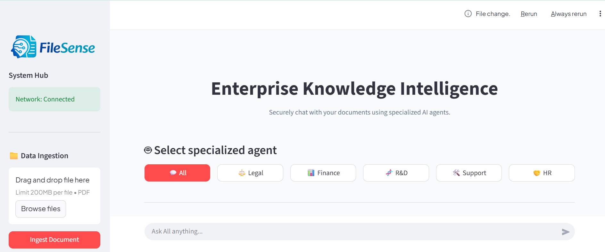

# FileSense: Enterprise Document Intelligence

**FileSense** is a production-ready **Retrieval-Augmented Generation (RAG)** application designed to transform how you interact with your data. Built with a modern **FastAPI** backend and a sleek, corporate-themed **Streamlit** frontend, FileSense allows you to upload PDFs and get precise, context-aware answers through a suite of specialized AI agents.



---

## Table of Contents
* [What is RAG?](#-what-is-rag)
* [Tech Stack](#-tech-stack)
* [Key Features](#-key-features)
* [Project Structure](#-project-structure)
* [Getting Started (Local)](#-getting-started-local)
* [Dockerization (The Easy Way)](#-dockerization-the-easy-way)
* [How to Use](#-how-to-use)

---

Large Language Model (LLMs) are pre trained on the specific data or in broader term we can say that it was trained on the all data available on the internet but for instance, if you have your company's data or policies which wasn't shared on interned due to security reasons or others, that is where the **RAG (Retrieval-Augmented Generation)** comes into the picture. 

If you want a brief idea about RAG, you can read my LinkedIn post:  
[Brief intro to RAG on LinkedIn](https://www.linkedin.com/posts/muhammad-haris-imtiaz-026791222_retrievalaugmentedgeneration-rag-generativeai-activity-7387235134120542208-u6g_?utm_source=share&utm_medium=member_desktop&rcm=ACoAADgAE94B1i-6pDD67E2x0VWtaOyhV_Kg-_0)


## What is RAG?

If you are new to AI, **RAG (Retrieval-Augmented Generation)** is a technique that gives a Large Language Model (like Gemini, Groq or others) access to specific data it wasn't originally trained on like your private company PDFs. 

**How it works in FileSense:**
1. **Ingestion:** You upload a PDF.
2. **Chunking & Embedding:** The system breaks the PDF into small pieces and converts them into mathematical vectors.
3. **Storage:** These vectors are stored in **ChromaDB**.
4. **Retrieval:** When you ask a question, FileSense finds the most relevant pieces of your PDF.
5. **Augmentation:** It combines those pieces with your question and sends them to the AI to generate a grounded, factual answer.


---

## Tech Stack

* **Frontend:** Streamlit (Custom "FileSense Blue" Theme)
* **Backend:** FastAPI (High-performance Asynchronous Python)
* **LLM:** Google Gemini 1.5 Flash
* **Vector Database:** ChromaDB
* **Embeddings:** HuggingFace (`all-MiniLM-L6-v2`)
* **Package Manager:** `uv` (Fastest Python package management)

---

## Key Features

* **Specialized AI Agents:** Toggle between "Legal", "Finance", "HR", and more to refine the focus of your queries.
* **Corporate UI:** A modern, high-contrast professional interface designed for enterprise usability.
* **Real-time Connectivity:** Live health checks in the sidebar to monitor backend and database status.
* **Full Containerization:** Deploy anywhere instantly with Docker and Docker Compose.
* **Lightning Fast:** Optimized dependency resolution and build times using `uv`.

---

## Project Structure

```text
FileSense/
├── app/                  # FastAPI Backend logic
│   ├── api/              # API Endpoints (Chat, Upload)
│   ├── core/             # Database & Security Configuration
│   ├── services/         # RAG Engine & AI Logic
│   └── main.py           # Backend Entrypoint
├── chroma_db_data/       # Persistent Vector Storage
├── logo.png              # FileSense Branding
├── ui.py                 # Streamlit Frontend Interface
├── pyproject.toml        # Environment & Dependencies
├── Dockerfile            # Container definition
└── docker-compose.yml    # Multi-service orchestration
```
# FileSense Guide

Follow these steps to get your own instance of **FileSense** up and running in minutes.

---

## 🛠 1. Prerequisites
Before you begin, ensure you have the following installed:
* **Python 3.10+**
* **[uv](https://github.com/astral-sh/uv)** (Recommended for speed)
* **Docker & Docker Compose** (Optional, for containerized setup)
* **Google Gemini API Key** (Get it from [Google AI Studio](https://aistudio.google.com/))

---

## 2. Environment Configuration
Create a file named `.env` in the project root directory and add your API key:

```env
GOOGLE_API_KEY=your_gemini_api_key_here
OPENROUTER_API_KEY=your_openrouter_key_here
```
## 3. Run the Backend
```
uv run uvicorn app.main:app --reload --port 8000
```
## 4. Run the Frontend
```
uv run streamlit run ui.py
```
Enjoy!

## Developed by Muhammad Haris ❤️